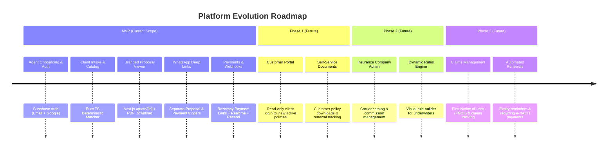
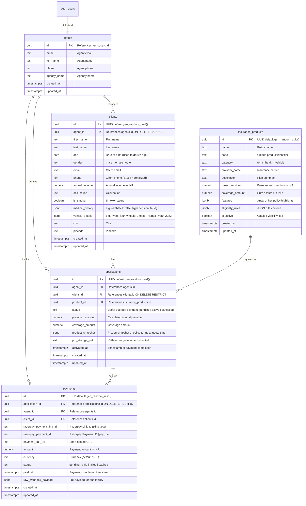
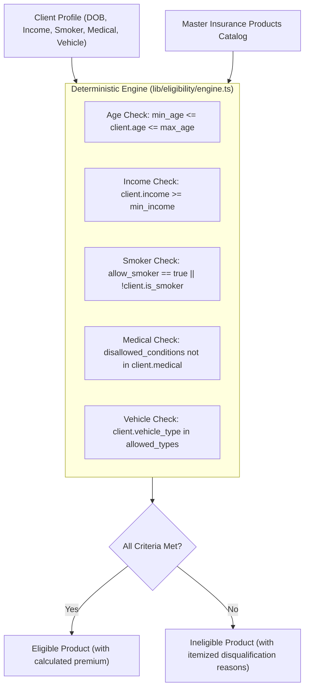
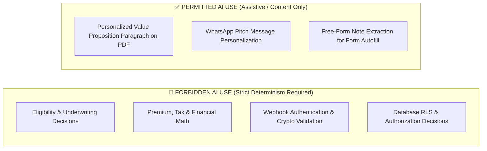
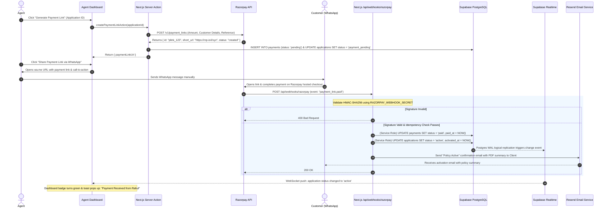
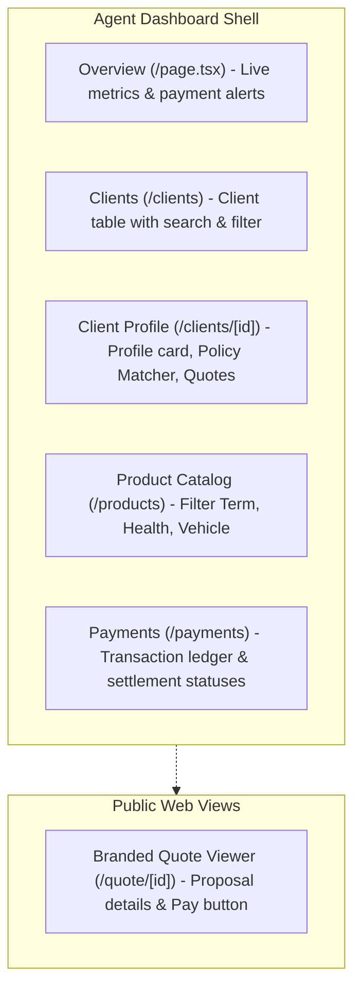
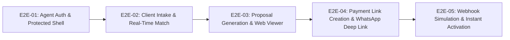
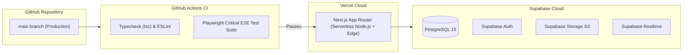

# Insurance Agent Platform — System Architecture & Design Specification

> **Version:** 1.1.0  
> **Status:** Approved / Active  
> **Target Audience:** Engineering Team, AI Coding Agents, System Architects  
> **Related Document:** [`docs/product.md`](file:///home/softrefine/Documents/insuarance-mvp/docs/product.md)

---

## Table of Contents

1. [Executive Summary & Architectural Principles](#1-executive-summary--architectural-principles)
2. [Scope Boundaries & Evolution Roadmap](#2-scope-boundaries--evolution-roadmap)
3. [High-Level Application Architecture](#3-high-level-application-architecture)
4. [Next.js App Router Structure & Boundary Strategy](#4-nextjs-app-router-structure--boundary-strategy)
5. [Supabase Architecture & Auto-Generated APIs](#5-supabase-architecture--auto-generated-apis)
6. [Database Entities, Relationships & Schema (with ERD)](#6-database-entities-relationships--schema-with-erd)
7. [Authentication, Authorization & Row-Level Security (RLS)](#7-authentication-authorization--row-level-security-rls)
8. [Deterministic Eligibility Engine & Strict AI Boundaries](#8-deterministic-eligibility-engine--strict-ai-boundaries)
9. [PDF Generation, Storage & Branded Client Web Viewer](#9-pdf-generation-storage--branded-client-web-viewer)
10. [Payment Flow, Razorpay Integration & Webhook Lifecycle](#10-payment-flow-razorpay-integration--webhook-lifecycle)
11. [External Integrations](#11-external-integrations)
12. [Major Frontend Modules & UX Architecture](#12-major-frontend-modules--ux-architecture)
13. [Critical End-to-End (E2E) Testing Strategy](#13-critical-end-to-end-e2e-testing-strategy)
14. [Deployment & Infrastructure Architecture](#14-deployment--infrastructure-architecture)
15. [Critical Edge Cases & Production Resilience](#15-critical-edge-cases--production-resilience)
16. [Architectural Decision Records (ADRs) & Trade-Off Matrix](#16-architectural-decision-records-adrs--trade-off-matrix)

---

## 1. Executive Summary & Architectural Principles

The **Insurance Agent Platform MVP** is a high-velocity, production-ready web application enabling insurance agents to onboard clients, evaluate policy eligibility deterministically, generate personalized proposal PDFs, share materials via WhatsApp deep links, and collect digital premium payments via Razorpay with automated reconciliation and real-time dashboard notifications.

### Core Architectural Principles

1. **Leverage Managed BaaS (Supabase Auto-Generated APIs):** Eliminate redundant Next.js CRUD API routes by exposing PostgreSQL tables directly through Supabase PostgREST Data APIs governed by PostgreSQL Row-Level Security (RLS).
2. **PostgreSQL RLS as the Single Source of Truth for Security:** Authorize data access strictly at the database layer. No agent can ever query or mutate another agent's records.
3. **Deterministic Core:** Keep all business logic, eligibility criteria matching, and financial pricing 100% deterministic, type-safe, and auditable in pure TypeScript.
4. **Zero-Overhead Integrations:** Use native browser URL schemes for WhatsApp (`wa.me`) and hosted checkout links for Razorpay to achieve rapid MVP delivery (1–2 days) with zero third-party approval delays.
5. **Phase Extensibility:** Architect database schemas with tenant and client foreign keys so future phases (**Phase 1: Customer Portal**, **Phase 2: Carrier Admin**, **Phase 3: Claims & Operations**) plug in cleanly as additive extensions without schema rewrites.

---

## 2. Scope Boundaries & Evolution Roadmap



### Out-of-Scope Guardrails for MVP
- ❌ **No Customer Login Portal:** The customer accesses quotes via a public tokenized web page (`/quote/[id]`) and completes payments via Razorpay hosted checkout.
- ❌ **No WhatsApp Business Cloud API:** Communication uses client-side deep links (`https://wa.me/...`).
- ❌ **No Document E-Signing:** The generated PDF is a personalized quote and policy summary.
- ❌ **No Multi-Role Admin Hierarchy:** Single authenticated role in MVP (`agent`).

---

## 3. High-Level Application Architecture

The system operates across two clear tracks:
1. **Direct Data Layer (PostgREST Auto-Generated APIs):** Standard CRUD queries for clients, catalog products, quotes, and payment histories run directly between the frontend/server components and Supabase PostgreSQL via the Supabase client SDK.
2. **Privileged Orchestration Layer (Next.js Server Actions & Route Handlers):** Workflows requiring external secret API keys, cryptographic signature verification, or document rendering are executed in Next.js.

```mermaid
flowchart TB
    subgraph ClientBrowser["Frontend (Browser / Agent UI)"]
        UI["Next.js React UI (App Router)"]
        RTClient["Supabase Realtime Listener (WebSocket)"]
    end

    subgraph CustomerBrowser["Customer Browser (Mobile / Desktop)"]
        QuoteViewer["Branded Quote Viewer (/quote/[id])"]
        RPCheckout["Razorpay Hosted Checkout Page"]
    end

    subgraph NextServer["Next.js Serverless Backend (Vercel)"]
        ServerAction["Payment Server Action (createPaymentLinkAction)"]
        PDFRoute["PDF Stream Generator (/api/documents/[applicationId])"]
        RPWebhook["Razorpay Webhook (/api/webhooks/razorpay)"]
    end

    subgraph SupabasePlatform["Supabase Platform"]
        Auth["Supabase Auth (GoTrue)"]
        PostgREST["Auto-Generated PostgREST Data API (/rest/v1/*)"]
        DB[(PostgreSQL 15+ with Strict RLS)]
        Storage["Supabase Storage (policy-documents bucket)"]
        RealtimeEngine["Supabase Realtime (Logical Replication)"]
    end

    subgraph ExternalServices["External Services"]
        Razorpay["Razorpay API & Hosted Checkout"]
        Resend["Resend Transactional Email"]
        WhatsApp["WhatsApp Client / Web (wa.me)"]
    end

    %% Direct Data Paths
    UI -->|1. Direct CRUD via PostgREST| PostgREST
    PostgREST -->|Enforces RLS per JWT| DB
    UI -->|Auth operations| Auth
    RealtimeEngine -.->|Websocket payment notifications| RTClient

    %% Privileged Paths
    UI -->|2. Request Payment Link| ServerAction
    ServerAction -->|Create Link via Secret Key| Razorpay
    ServerAction -->|Insert pending payment record| DB

    %% Agent WhatsApp Sharing Actions
    UI -->|3a. Share Proposal Link (/quote/[id])| WhatsApp
    UI -->|3b. Share Payment Link (Razorpay URL)| WhatsApp
    WhatsApp -->|Delivers link to| CustomerBrowser

    CustomerBrowser -->|Opens Proposal| QuoteViewer
    QuoteViewer -->|Downloads PDF Asset| PDFRoute
    CustomerBrowser -->|Opens Payment Link| RPCheckout

    %% Webhook Path
    Razorpay -->|4. Webhook: payment_link.paid| RPWebhook
    RPWebhook -->|HMAC Verify & Admin Service Role Update| DB
    DB -->|Postgres change event| RealtimeEngine
    RPWebhook -->|5. Send Activation Email| Resend
    Resend -->|Delivers confirmation email| CustomerBrowser

    %% Document Generation Path
    PDFRoute -->|Render React-PDF & Store Asset| Storage
```

---

## 4. Next.js App Router Structure & Boundary Strategy

### Directory Layout

```
insurance-mvp/
├── docs/
│   ├── product.md
│   └── architecture.md
├── src/
│   ├── app/
│   │   ├── (auth)/
│   │   │   ├── login/page.tsx           # Email/Password + Google OAuth login
│   │   │   ├── signup/page.tsx          # Agent registration
│   │   │   └── callback/route.ts        # Supabase OAuth PKCE exchange handler
│   │   ├── (dashboard)/
│   │   │   ├── layout.tsx               # Protected dashboard shell & Realtime provider
│   │   │   ├── page.tsx                 # Agent overview (metrics, recent activities)
│   │   │   ├── clients/
│   │   │   │   ├── page.tsx             # Client list (Direct Supabase query)
│   │   │   │   ├── new/page.tsx         # New client intake form
│   │   │   │   └── [clientId]/
│   │   │   │       ├── page.tsx         # Client profile, matched policies & quotes
│   │   │   │       └── edit/page.tsx    # Edit client details
│   │   │   ├── products/
│   │   │   │   └── page.tsx             # Master catalog browser
│   │   │   └── payments/
│   │   │       └── page.tsx             # Agent payment ledger & status tracker
│   │   ├── (public)/
│   │   │   └── quote/
│   │   │       └── [quoteId]/page.tsx   # Branded mobile-friendly client proposal viewer
│   │   └── api/
│   │       ├── webhooks/
│   │       │   └── razorpay/route.ts    # Razorpay Webhook receiver (signature verified)
│   │       └── documents/
│   │           └── [applicationId]/route.ts # PDF generator stream / signed URL redirect
│   ├── components/
│   │   ├── ui/                          # UI primitives (buttons, modals, badges, inputs)
│   │   ├── forms/                       # Zod-validated React Hook Form components
│   │   │   ├── client-form.tsx
│   │   │   └── create-quote-modal.tsx
│   │   ├── eligibility/                 # Policy match breakdown cards & criteria pills
│   │   ├── pdf/                         # @react-pdf visual template & in-modal viewer
│   │   │   ├── policy-document-template.tsx
│   │   │   └── pdf-preview-modal.tsx
│   │   └── providers/                   # Realtime notification context & toast listener
│   ├── lib/
│   │   ├── supabase/
│   │   │   ├── client.ts                # Browser client (createBrowserClient)
│   │   │   ├── server.ts                # Server client (createServerClient with cookies)
│   │   │   └── admin.ts                 # Service Role admin client (strictly for webhooks)
│   │   ├── eligibility/
│   │   │   ├── engine.ts                # Deterministic matching engine (Pure TS)
│   │   │   └── rules.ts                 # Individual rule evaluators (Age, Income, Smoker, etc.)
│   │   ├── razorpay/
│   │   │   └── client.ts                # Razorpay SDK initialization & payment link creator
│   │   ├── email/
│   │   │   └── resend.ts                # Resend client & transactional templates
│   │   └── utils/
│   │       ├── whatsapp.ts              # WhatsApp URL builders for Proposal & Payment
│   │       ├── formatters.ts            # Currency (INR) and date formatters
│   │       └── validators.ts            # Zod validation schemas
│   ├── server/
│   │   └── actions/
│   │       ├── payment-actions.ts       # Razorpay link creation + payment record insert
│   │       └── application-actions.ts   # Quote creation & document trigger
│   └── types/
│       ├── database.types.ts            # Supabase CLI auto-generated PostgreSQL types
│       ├── eligibility.types.ts         # Rule engine interfaces
│       └── product.types.ts             # Domain models
├── middleware.ts                        # Supabase session refresh & route protection
├── tailwind.config.ts
└── tsconfig.json
```

---

## 5. Supabase Architecture & Auto-Generated APIs

### Auto-Generated PostgREST Data API
Supabase reflects the PostgreSQL database directly into a RESTful API with automated OpenAPI specifications:
- **Direct Querying:** `supabase.from('clients').select('*').eq('agent_id', user.id)` translates to `GET /rest/v1/clients?agent_id=eq.<user_id>`.
- **Relational Joins:** Deep joins are executed natively in a single query:
  ```typescript
  const { data: applications } = await supabase
    .from('applications')
    .select(`
      id,
      status,
      premium_amount,
      client:clients (first_name, last_name, email, phone),
      product:insurance_products (name, category, provider_name),
      payments (status, amount, paid_at, payment_link_url)
    `)
    .eq('agent_id', user.id);
  ```
- **Type Generation:** PostgreSQL schemas are directly compiled into TypeScript definitions:
  ```bash
  supabase gen types typescript --local > src/types/database.types.ts
  ```

---

## 6. Database Entities, Relationships & Schema (with ERD)



### PostgreSQL DDL & Seed Migration Script

```sql
-- 1. Agents Table
CREATE TABLE public.agents (
    id UUID PRIMARY KEY REFERENCES auth.users(id) ON DELETE CASCADE,
    email TEXT NOT NULL,
    full_name TEXT NOT NULL,
    phone TEXT,
    agency_name TEXT,
    created_at TIMESTAMPTZ NOT NULL DEFAULT timezone('utc'::text, now()),
    updated_at TIMESTAMPTZ NOT NULL DEFAULT timezone('utc'::text, now())
);

-- Automatic Agent Profile Creation Trigger
CREATE OR REPLACE FUNCTION public.handle_new_agent()
RETURNS TRIGGER AS $$
BEGIN
    INSERT INTO public.agents (id, email, full_name)
    VALUES (
        new.id,
        new.email,
        COALESCE(new.raw_user_meta_data->>'full_name', 'Insurance Agent')
    );
    RETURN NEW;
END;
$$ LANGUAGE plpgsql SECURITY DEFINER;

CREATE TRIGGER on_auth_user_created
    AFTER INSERT ON auth.users
    FOR EACH ROW EXECUTE FUNCTION public.handle_new_agent();

-- 2. Clients Table
CREATE TABLE public.clients (
    id UUID PRIMARY KEY DEFAULT gen_random_uuid(),
    agent_id UUID NOT NULL REFERENCES public.agents(id) ON DELETE CASCADE,
    first_name TEXT NOT NULL,
    last_name TEXT NOT NULL,
    dob DATE NOT NULL,
    gender TEXT NOT NULL,
    email TEXT NOT NULL,
    phone TEXT NOT NULL,
    annual_income NUMERIC(12, 2) NOT NULL DEFAULT 0,
    occupation TEXT,
    is_smoker BOOLEAN NOT NULL DEFAULT false,
    medical_history JSONB NOT NULL DEFAULT '{}'::jsonb,
    vehicle_details JSONB NOT NULL DEFAULT '{}'::jsonb,
    city TEXT,
    pincode TEXT,
    created_at TIMESTAMPTZ NOT NULL DEFAULT timezone('utc'::text, now()),
    updated_at TIMESTAMPTZ NOT NULL DEFAULT timezone('utc'::text, now())
);
CREATE INDEX idx_clients_agent_id ON public.clients(agent_id);

-- 3. Insurance Products Table
CREATE TABLE public.insurance_products (
    id UUID PRIMARY KEY DEFAULT gen_random_uuid(),
    name TEXT NOT NULL,
    code TEXT NOT NULL UNIQUE,
    category TEXT NOT NULL CHECK (category IN ('term', 'health', 'vehicle')),
    provider_name TEXT NOT NULL,
    description TEXT NOT NULL,
    base_premium NUMERIC(10, 2) NOT NULL,
    coverage_amount NUMERIC(12, 2) NOT NULL,
    features JSONB NOT NULL DEFAULT '[]'::jsonb,
    eligibility_rules JSONB NOT NULL DEFAULT '{}'::jsonb,
    is_active BOOLEAN NOT NULL DEFAULT true,
    created_at TIMESTAMPTZ NOT NULL DEFAULT timezone('utc'::text, now()),
    updated_at TIMESTAMPTZ NOT NULL DEFAULT timezone('utc'::text, now())
);
CREATE INDEX idx_products_category ON public.insurance_products(category) WHERE is_active = true;

-- 4. Applications (Quotes) Table
CREATE TABLE public.applications (
    id UUID PRIMARY KEY DEFAULT gen_random_uuid(),
    agent_id UUID NOT NULL REFERENCES public.agents(id) ON DELETE CASCADE,
    client_id UUID NOT NULL REFERENCES public.clients(id) ON DELETE RESTRICT,
    product_id UUID NOT NULL REFERENCES public.insurance_products(id) ON DELETE RESTRICT,
    status TEXT NOT NULL DEFAULT 'quoted' CHECK (status IN ('draft', 'quoted', 'payment_pending', 'active', 'cancelled')),
    premium_amount NUMERIC(10, 2) NOT NULL,
    coverage_amount NUMERIC(12, 2) NOT NULL,
    product_snapshot JSONB NOT NULL,
    pdf_storage_path TEXT,
    activated_at TIMESTAMPTZ,
    created_at TIMESTAMPTZ NOT NULL DEFAULT timezone('utc'::text, now()),
    updated_at TIMESTAMPTZ NOT NULL DEFAULT timezone('utc'::text, now())
);
CREATE INDEX idx_applications_agent_id ON public.applications(agent_id);
CREATE INDEX idx_applications_client_id ON public.applications(client_id);
CREATE INDEX idx_applications_status ON public.applications(status);

-- 5. Payments Table
CREATE TABLE public.payments (
    id UUID PRIMARY KEY DEFAULT gen_random_uuid(),
    application_id UUID NOT NULL REFERENCES public.applications(id) ON DELETE RESTRICT,
    agent_id UUID NOT NULL REFERENCES public.agents(id) ON DELETE CASCADE,
    client_id UUID NOT NULL REFERENCES public.clients(id) ON DELETE RESTRICT,
    razorpay_payment_link_id TEXT UNIQUE,
    razorpay_payment_id TEXT,
    payment_link_url TEXT NOT NULL,
    amount NUMERIC(10, 2) NOT NULL,
    currency TEXT NOT NULL DEFAULT 'INR',
    status TEXT NOT NULL DEFAULT 'pending' CHECK (status IN ('pending', 'paid', 'failed', 'expired')),
    paid_at TIMESTAMPTZ,
    raw_webhook_payload JSONB,
    created_at TIMESTAMPTZ NOT NULL DEFAULT timezone('utc'::text, now()),
    updated_at TIMESTAMPTZ NOT NULL DEFAULT timezone('utc'::text, now())
);
CREATE UNIQUE INDEX idx_payments_rp_link_id ON public.payments(razorpay_payment_link_id);
CREATE INDEX idx_payments_agent_id ON public.payments(agent_id);

-- Initial Catalog Seed Data
INSERT INTO public.insurance_products (name, code, category, provider_name, description, base_premium, coverage_amount, features, eligibility_rules)
VALUES
(
    'SecureLife Pure Term Plan',
    'TERM-SECURE-01',
    'term',
    'HDFC Life',
    'Comprehensive term life cover with accidental death benefit.',
    12000.00,
    10000000.00,
    '["Cover up to age 85", "Tax benefits under 80C", "Instant claim payout"]'::jsonb,
    '{"min_age": 18, "max_age": 60, "min_income": 300000, "allow_smoker": true}'::jsonb
),
(
    'HealthOptima Comprehensive Plan',
    'HEALTH-OPTIMA-01',
    'health',
    'Star Health',
    'Cashless hospitalization across 14,000+ network hospitals.',
    18500.00,
    1000000.00,
    '["Zero room rent capping", "Day-care treatments covered", "Annual health checkup"]'::jsonb,
    '{"min_age": 18, "max_age": 65, "min_income": 200000, "allow_smoker": true, "disallowed_medical": ["cancer", "heart_disease"]}'::jsonb
),
(
    'DriveProtect Comprehensive Car Insurance',
    'VEHICLE-CAR-01',
    'vehicle',
    'ICICI Lombard',
    'Bumper-to-bumper car insurance with zero depreciation add-on.',
    8500.00,
    800000.00,
    '["Zero depreciation cover", "24x7 Roadside Assistance", "Engine protect add-on"]'::jsonb,
    '{"allowed_vehicle_types": ["four_wheeler"]}'::jsonb
),
(
    'RideSecure Two-Wheeler Insurance',
    'VEHICLE-BIKE-01',
    'vehicle',
    'Bajaj Allianz',
    'Full protection for two-wheelers including personal accident cover.',
    2200.00,
    150000.00,
    '["Instant policy issue", "Third-party & Own Damage cover", "No Inspection required"]'::jsonb,
    '{"allowed_vehicle_types": ["two_wheeler"]}'::jsonb
);
```

---

## 7. Authentication, Authorization & Row-Level Security (RLS)

```sql
-- Enable RLS across all tables
ALTER TABLE public.agents ENABLE ROW LEVEL SECURITY;
ALTER TABLE public.clients ENABLE ROW LEVEL SECURITY;
ALTER TABLE public.insurance_products ENABLE ROW LEVEL SECURITY;
ALTER TABLE public.applications ENABLE ROW LEVEL SECURITY;
ALTER TABLE public.payments ENABLE ROW LEVEL SECURITY;

-- 1. Agents Profile Policy
CREATE POLICY "agents_self_manage"
ON public.agents FOR ALL TO authenticated
USING ((select auth.uid()) = id)
WITH CHECK ((select auth.uid()) = id);

-- 2. Insurance Products: Read-Only for Authenticated Agents & Public Quote Pages
CREATE POLICY "products_read_active"
ON public.insurance_products FOR SELECT TO authenticated, anon
USING (is_active = true);

-- 3. Clients Policy: Strict Agent Isolation
CREATE POLICY "clients_agent_manage"
ON public.clients FOR ALL TO authenticated
USING ((select auth.uid()) = agent_id)
WITH CHECK ((select auth.uid()) = agent_id);

-- 4. Applications Policy: Isolated per Agent (Anon can read single quote for public viewer)
CREATE POLICY "applications_agent_manage"
ON public.applications FOR ALL TO authenticated
USING ((select auth.uid()) = agent_id)
WITH CHECK ((select auth.uid()) = agent_id);

CREATE POLICY "applications_public_quote_read"
ON public.applications FOR SELECT TO anon
USING (true);

-- 5. Payments Policy: Read-Only for Agents
CREATE POLICY "payments_agent_read"
ON public.payments FOR SELECT TO authenticated
USING ((select auth.uid()) = agent_id);
```

---

## 8. Deterministic Eligibility Engine & Strict AI Boundaries

### Deterministic Rule Engine Specification



#### Rule Evaluation Algorithm
```typescript
export interface RuleCriteria {
  min_age?: number;
  max_age?: number;
  min_income?: number;
  allow_smoker?: boolean;
  disallowed_medical?: string[];
  allowed_vehicle_types?: string[];
}

export function evaluatePolicyEligibility(
  client: ClientRecord,
  product: InsuranceProductRecord
): EligibilityEvaluationResult {
  const age = calculateAge(client.dob);
  const reasons: string[] = [];
  const rules = product.eligibility_rules as RuleCriteria;

  if (rules.min_age !== undefined && age < rules.min_age) {
    reasons.push(`Minimum age required is ${rules.min_age} years (client is ${age})`);
  }
  if (rules.max_age !== undefined && age > rules.max_age) {
    reasons.push(`Maximum age limit is ${rules.max_age} years (client is ${age})`);
  }
  if (rules.min_income !== undefined && Number(client.annual_income) < rules.min_income) {
    reasons.push(`Minimum annual income required is ₹${rules.min_income.toLocaleString('en-IN')}`);
  }
  if (rules.allow_smoker === false && client.is_smoker) {
    reasons.push('Policy does not cover active tobacco or nicotine users');
  }
  if (rules.disallowed_medical && rules.disallowed_medical.length > 0) {
    const preExisting = Object.entries(client.medical_history || {})
      .filter(([_, value]) => Boolean(value))
      .map(([key]) => key);
    const conflicts = preExisting.filter(cond => rules.disallowed_medical!.includes(cond));
    if (conflicts.length > 0) {
      reasons.push(`Pre-existing condition(s) not eligible for standard quote: ${conflicts.join(', ')}`);
    }
  }
  if (product.category === 'vehicle' && rules.allowed_vehicle_types) {
    const vehicleType = client.vehicle_details?.type;
    if (!vehicleType || !rules.allowed_vehicle_types.includes(vehicleType)) {
      reasons.push(`Vehicle type '${vehicleType || 'Unknown'}' is not eligible under this policy`);
    }
  }

  return {
    productId: product.id,
    isEligible: reasons.length === 0,
    disqualificationReasons: reasons,
    calculatedPremium: calculateFinalPremium(product.base_premium, client, product.category)
  };
}
```

---

### Strict AI Boundaries



---

## 9. PDF Generation, Storage & Branded Client Web Viewer

### Document Lifecycle & Branded Viewer Architecture
1. **Generation:** When an agent creates a quote, `@react-pdf/renderer` renders the document stream server-side and stores it in Supabase Storage (`policy-documents/{agent_id}/{application_id}.pdf`).
2. **Branded Public Viewer Route (`/quote/[quoteId]`):**
   - Clean, mobile-friendly landing page for the client.
   - Displays client name, policy name, key features, premium breakdown, and agent contact details.
   - Includes a **"Download Official PDF Proposal"** button (streams PDF from `/api/documents/[applicationId]`).
   - If a payment link exists for this application, renders a prominent **"Pay Premium Now (₹X,XXX)"** button leading directly to Razorpay checkout.

---

## 10. Payment Flow, Razorpay Integration & Webhook Lifecycle



---

## 11. External Integrations

### WhatsApp Deep Link Action Architecture
The platform provides **two distinct, explicit WhatsApp share actions**:

1. **Action 1: "Share Proposal Link" (Pitch Phase):**
   ```typescript
   export function buildProposalWhatsAppUrl(phone: string, clientName: string, policyName: string, quoteUrl: string): string {
     const formattedPhone = formatE164IndianPhone(phone);
     const text = `Hello ${clientName},\n\nI have prepared your personalized insurance proposal for *${policyName}*.\n\n📄 View your proposal and coverage details here:\n${quoteUrl}\n\nPlease let me know if you would like to proceed!`;
     return `https://wa.me/${formattedPhone}?text=${encodeURIComponent(text)}`;
   }
   ```

2. **Action 2: "Share Payment Link" (Closing Phase):**
   ```typescript
   export function buildPaymentWhatsAppUrl(phone: string, clientName: string, policyName: string, amount: number, paymentUrl: string): string {
     const formattedPhone = formatE164IndianPhone(phone);
     const text = `Hello ${clientName},\n\nYour policy application for *${policyName}* (Premium: ₹${amount.toLocaleString('en-IN')}) is ready for activation.\n\n💳 Complete your secure payment here:\n${paymentUrl}\n\nOnce paid, your policy will be activated instantly and confirmation sent to your email.`;
     return `https://wa.me/${formattedPhone}?text=${encodeURIComponent(text)}`;
   }
   ```

---

## 12. Major Frontend Modules & UX Architecture



---

## 13. Critical End-to-End (E2E) Testing Strategy

To guarantee rapid delivery and high production confidence without test maintenance overhead, the automated test suite is **strictly focused on 5 Critical End-to-End (E2E) Test Journeys** using Playwright.



### The 5 Critical E2E Test Scenarios

| Test ID | Test Scenario Name | Core Verification Steps | Pass Criteria |
| :--- | :--- | :--- | :--- |
| **E2E-01** | **Agent Authentication & Route Guarding** | 1. Navigate to `/dashboard` unauthenticated.<br>2. Verify redirection to `/login`.<br>3. Submit valid agent credentials.<br>4. Verify successful redirection to `/dashboard` shell. | Protected dashboard loads with agent profile name. |
| **E2E-02** | **Client Intake & Policy Matching** | 1. Navigate to `/clients/new`.<br>2. Fill client form (Age 32, Income ₹8L, Non-smoker, Healthy, 4-Wheeler Car).<br>3. Submit form.<br>4. Verify redirect to `/clients/[clientId]`. | Client profile displays matched eligible plans (Term, Health, Car) and excludes incompatible plans with clear reasons. |
| **E2E-03** | **Proposal Creation & Branded Viewer** | 1. On client profile, click "Create Quote" on matched Health Plan.<br>2. Verify quote is created and PDF preview opens in modal.<br>3. Navigate to public URL `/quote/[quoteId]`. | Public quote viewer renders policy breakdown and PDF download trigger correctly. |
| **E2E-04** | **Payment Link Creation & WhatsApp Link** | 1. On quote card, click "Generate Payment Link".<br>2. Verify mocked Razorpay API generates link.<br>3. Inspect "Share Payment Link via WhatsApp" button. | Payment status displays "Pending" and WhatsApp button contains correctly encoded `wa.me` URL with payment link. |
| **E2E-05** | **Razorpay Webhook & Real-Time Activation** | 1. Send simulated `payment_link.paid` POST request to `/api/webhooks/razorpay` with valid HMAC signature.<br>2. Verify HTTP 200 response.<br>3. Check client profile in browser. | Application status badge turns green (`Active`), payment is marked `Paid`, and Resend email mock is triggered. |

---

## 14. Deployment & Infrastructure Architecture



---

## 15. Critical Edge Cases & Production Resilience

| Edge Case | Potential Failure Mode | Architectural Mitigation |
| :--- | :--- | :--- |
| **Duplicate Webhook Delivery** | Razorpay retries webhook deliveries, risking duplicate confirmation emails or database state corruption. | **Idempotent Webhook Handler:** Query payment record first; if `status === 'paid'`, immediately return `HTTP 200 OK` and skip database updates and email triggers. |
| **Catalog Price & Term Changes** | Admin alters policy premium or coverage, corrupting historical quotes or active policies. | **Immutable Product Snapshotting:** Store an immutable JSON snapshot (`product_snapshot` in `applications`) at the time of quotation. |
| **WhatsApp Phone Number Formatting** | Malformed links due to missing country codes, dashes, spaces, or leading zeros. | **E.164 Normalizer:** Utility function strips all non-numeric characters and guarantees standard 10-digit Indian numbers are formatted with the `91` prefix. |
| **Serverless PDF Memory Limits** | Headless browsers causing function cold-starts, memory spikes, or Vercel timeouts. | **Pure Stream Rendering:** `@react-pdf/renderer` generates light PDF buffers (<150KB) in <400ms without spinning up Chromium instances. |
| **Payment Link Expiration** | Customer opens an expired link. | Razorpay blocks payment automatically; webhook captures `payment_link.expired` event and marks the payment record as `expired`. |
| **Cross-Tenant IDOR Vulnerability** | Malicious agent attempts to query another agent's client UUID. | **PostgreSQL RLS:** Database engine rejects queries where `agent_id != (select auth.uid())`, returning zero rows. |

---

## 16. Architectural Decision Records (ADRs) & Trade-Off Matrix

### ADR 1: Use Supabase Auto-Generated APIs (PostgREST) vs Custom Next.js CRUD API Layer
- **Status:** Approved
- **Decision:** Use Supabase auto-generated PostgREST Data APIs for standard CRUD data access; reserve Next.js Server Actions and Route Handlers strictly for secret-bearing operations (Razorpay API calls, webhook signature validation, PDF generation, email dispatch).
- **Trade-Off Analysis:**
  - *Pros:* Eliminates hundreds of lines of boilerplate CRUD endpoints; provides instantaneous type safety via `supabase gen types`; leverages PostgreSQL RLS directly as the security boundary.
  - *Cons:* Developers must write and maintain PostgreSQL RLS policies meticulously.

---

### ADR 2: Deterministic In-Memory TypeScript Eligibility Engine vs AI/LLM Matching
- **Status:** Approved
- **Decision:** Implement insurance eligibility rules and premium pricing as pure, deterministic TypeScript functions. Prohibit LLMs from making underwriting or eligibility decisions.
- **Trade-Off Analysis:**
  - *Pros:* 100% auditable, zero regulatory liability, zero hallucination risk, sub-millisecond execution, zero API costs.
  - *Cons:* Requires eligibility criteria to be defined as structured JSON schemas in the database.

---

### ADR 3: Two Distinct WhatsApp Share Actions via Browser URL Scheme (`wa.me`)
- **Status:** Approved
- **Decision:** Provide two separate agent-triggered WhatsApp deep links: (1) "Share Proposal Link" (`/quote/[id]`) during the pitch, and (2) "Share Payment Link" once the client agrees to purchase.
- **Trade-Off Analysis:**
  - *Pros:* Matches the real-world sales consultation lifecycle; zero API verification delays; zero per-conversation costs.
  - *Cons:* Requires the agent to click to send messages from their own WhatsApp client.

---

### ADR 4: Branded Mobile Web Viewer (`/quote/[id]`) + `@react-pdf/renderer`
- **Status:** Approved
- **Decision:** Render a mobile-friendly proposal landing page at `/quote/[quoteId]` with direct PDF download and Razorpay "Pay Now" actions, backed by `@react-pdf/renderer` and Supabase Storage.
- **Trade-Off Analysis:**
  - *Pros:* Superior mobile viewing experience for customers on WhatsApp; sub-400ms serverless PDF generation without headless Chromium overhead.
  - *Cons:* Requires maintaining both a React web preview component and a `@react-pdf` template.

---

### ADR 5: Razorpay Hosted Payment Links & Resend Transactional Email
- **Status:** Approved
- **Decision:** Generate Razorpay hosted payment links (`/v1/payment_links`) and trigger automated policy activation and confirmation emails via Resend on webhook verification.
- **Trade-Off Analysis:**
  - *Pros:* Zero PCI compliance requirements; out-of-the-box support for UPI, Cards, and Netbanking; instant email delivery with modern React email templates.
  - *Cons:* Client completes payment on Razorpay's hosted domain rather than an in-app form.
