# InsureAgent: Design System Specification

---

## 1. Design Vision & Visual Identity

The InsureAgent design system is based on a modern, high-contrast insurtech aesthetic (inspired by LumiiHealth). It merges financial authority with high-speed digital workflows, replacing generic SaaS styling with a bold, distinctive visual identity.

### Core Visual Principles
- **Deep Pine & Electric Lime Identity:** Combines authoritative deep spruce/pine tones (`#061B1E` / `#0A262A`) with high-energy luminous pale lime accents (`#DCF763` / `#CAF03E`) to drive focus directly to key actions and active matches.
- **Bento-Style Information Cards:** Clean, modular cards with rounded corners (`rounded-2xl`), generous padding, and directional action arrows (`ArrowUpRight` icon).
- **Icons Instead of Emojis:** Always use clean vector icons (`lucide-react`) across all UI elements, status badges, buttons, cards, and headings. Avoid emojis in the interface to maintain a high-trust, professional insurtech aesthetic.
- **High-Contrast Data Presentation:** Tabular numerals for financial figures, clear sum assured highlights, and distinct visual treatments for eligible versus incompatible policies.
- **Mobile-First Client Experience:** The public proposal viewer (`/quote/[id]`) is optimized for mobile screens when clients open proposal links directly from WhatsApp.

---

## 2. Color Palette & Design Tokens

### Color Token Reference

| Token Name | Hex Code | Tailwind Equivalent | Usage |
| :--- | :--- | :--- | :--- |
| **Pine 950 (Brand Dark)** | `#061B1E` | `bg-pine-950`, `text-pine-950` | Primary navigation, hero sections, featured active cards, primary dark text |
| **Pine 900 (Surface Dark)** | `#0A262A` | `bg-pine-900`, `border-pine-900` | Sub-headers, dark card inner surfaces, dark borders |
| **Pine 800 (Dark Divider)** | `#0E3338` | `border-pine-800` | Dividers on dark backgrounds, dark subtle cards |
| **Lime 400 (Electric Accent)**| `#DCF763` | `bg-lime-400`, `text-lime-400` | Primary action buttons, active badge highlights, circular action arrows (`↗`) |
| **Lime 300 (Lime Hover)** | `#E6FA82` | `hover:bg-lime-300` | Hover state for lime buttons |
| **Lime 100 (Lime Tint)** | `#F2FCC2` | `bg-lime-100`, `border-lime-200` | Soft highlight badges, client eligibility indicators |
| **Surface White** | `#FFFFFF` | `bg-white` | Standard card surfaces, input fields, modals |
| **Surface Slate 50** | `#F8FAF9` | `bg-slate-50` | Page background, sub-card containers |
| **Border Slate 200** | `#E2E8F0` | `border-slate-200` | Hairline card borders, table dividers |
| **Success Emerald** | `#059669` | `text-emerald-600`, `bg-emerald-50`| Paid payment status, passed medical criteria |
| **Warning Amber** | `#D97706` | `text-amber-600`, `bg-amber-50` | Pending payment links, draft status |
| **Error Rose** | `#E11D48` | `text-rose-600`, `bg-rose-50` | Policy disqualification callouts, form errors |

---

## 3. Typography & Text Hierarchy

The platform uses **Plus Jakarta Sans** as the primary font family, paired with **JetBrains Mono** for financial figures and policy codes.

### Typographic Scale

| Level | Size / Line Height | Weight | Font Family | Usage |
| :--- | :--- | :--- | :--- | :--- |
| **Display / Hero H1** | `44px - 56px / 1.1` | Extra-Bold (800) | Plus Jakarta Sans | Landing headers, hero title with period punctuation |
| **Page Title / H2** | `28px - 32px / 1.2` | Extra-Bold (800) | Plus Jakarta Sans | Page headers, section titles |
| **Card Header / H3** | `18px - 22px / 1.3` | Bold (700) | Plus Jakarta Sans | Policy plan names, modal titles |
| **Section Label** | `11px / 14px` | Bold (700) | Plus Jakarta Sans | Uppercase tracking-widest section tags |
| **Body (Standard)** | `14px / 20px` | Regular / Medium (500) | Plus Jakarta Sans | Form labels, descriptions, table body |
| **Financial Figures** | `16px - 24px` | Extra-Bold (800) | JetBrains Mono | Premiums, coverage sums (`tabular-nums`) |
| **Metadata / Badges**| `10px - 12px` | Bold (700) | Plus Jakarta Sans | Status pills, carrier badges, timestamps |

---

## 4. Spacing, Elevation & Radii

### Border Radii System
- **Large Cards & Modals:** `rounded-2xl` (16px)
- **Buttons, Inputs & Sub-containers:** `rounded-xl` (12px)
- **Status Badges, Icon Nodes & CTAs:** `rounded-full` (9999px)

### Elevation & Borders
- **Standard Card:** `bg-white border border-slate-200 shadow-sm`
- **Active Dark Card:** `bg-pine-950 text-white shadow-xl`
- **Hover Transitions:** `transition-all duration-150 hover:shadow-md hover:border-slate-300`
- **Modal Overlay:** `bg-pine-950/70 backdrop-blur-sm`

---

## 5. shadcn/ui Component Inventory & Patterns

```mermaid
graph TD
    subgraph CorePrimitives["shadcn/ui Core Primitives"]
        Button["<Button /> (Lime CTA, Pine Solid, Outline, WhatsApp)"]
        Card["<Card /> (FeaturedPineCard, StandardWhiteCard, IneligibleCard)"]
        Badge["<Badge /> (LimeHighlight, EmeraldActive, AmberPending, RoseError)"]
        Input["<Input /> & <Label /> (High-legibility 12px rounded inputs)"]
        Dialog["<Dialog /> (WhatsApp Proposal & Payment Link Drawer)"]
        Table["<Table /> (Portfolio & Ledger with Tabular Figures)"]
        Icons["Icons (<LucideIcon /> Vector System, No Emojis)"]
    end
```

### Component Variant Guidelines

#### 1. Buttons (`<Button>`)
- **Primary Action (Electric Lime):**
  `bg-lime-400 hover:bg-lime-300 text-pine-950 font-extrabold rounded-xl shadow-sm`
  Used for primary actions: "Generate Quote", "Pay Premium with Razorpay", "Save Client Profile".
- **Secondary Dark (Deep Pine):**
  `bg-pine-950 hover:bg-pine-900 text-white font-bold rounded-xl`
  Used for secondary triggers: "Browse Catalog", "Add Another Policy".
- **WhatsApp Action:**
  `bg-emerald-600 hover:bg-emerald-700 text-white font-bold rounded-xl`
  Used for WhatsApp proposal sharing and direct client communication.
- **Outline / Ghost:**
  `bg-slate-100 hover:bg-slate-200 text-pine-950 font-bold rounded-xl`

#### 2. Product & Category Cards (`<Card>`)
- **Featured / Eligible Match Card (Deep Pine):**
  - Background: `bg-pine-950 text-white`
  - Icon: Top-left `12x12` icon container (`bg-pine-900 text-lime-400`)
  - Action Arrow: Top-right `10x10` circular lime button (`bg-lime-400 text-pine-950 font-bold`)
  - Pricing Box: Inner dark container (`bg-pine-900/80 border border-pine-800`) with lime monospace premium
- **Standard Eligible Card (Crisp White):**
  - Background: `bg-white border-2 border-slate-200 text-slate-900`
  - Icon: Slate rounded container with dark pine icon
  - Action Arrow: Circular outline button with dark hover
- **Incompatible Policy Card (Muted):**
  - Background: `bg-slate-50 border border-slate-200 opacity-80`
  - Disqualification Box: `bg-rose-50 border border-rose-100 text-rose-700`

#### 3. Badges & Pills (`<Badge>`)
- **Active / Paid:** `bg-emerald-50 text-emerald-700 border-emerald-200`
- **Payment Pending:** `bg-amber-50 text-amber-700 border-amber-200`
- **Ineligible:** `bg-rose-50 text-rose-700 border-rose-200`
- **Policy Category:** `bg-lime-100 text-pine-950 border-lime-300 font-bold`

#### 4. Iconography Standards (`lucide-react`)
- **Strict Rule - Use Icons, Not Emojis:** UI components must use vector icons from `lucide-react` instead of emojis across all UI elements, headings, cards, buttons, badges, tables, and dialogs.
- **Icon Sizing:**
  - Standard button/action icons: `w-4 h-4` (16px) or `w-5 h-5` (20px).
  - Feature card badge nodes: `w-5 h-5` (20px) to `w-6 h-6` (24px).
  - Metric / Hero icon containers: `w-6 h-6` (24px) within a `rounded-xl` container.
- **Standard Icon Mappings:**
  - Insurance categories: `Shield` (Term), `HeartPulse` (Health), `Car` (Vehicle).
  - Status indicators: `CheckCircle2` (Active/Paid), `Clock` (Pending), `AlertCircle` (Ineligible/Error).
  - Navigation & actions: `ArrowUpRight` (Open/Action), `FileText` (Proposal), `Share2` or `MessageSquare` (WhatsApp), `CreditCard` (Payment).

---

## 6. Page-by-Page UX & Layout Blueprints

### 1. Dashboard Layout (`(dashboard)/layout.tsx`)
- Fixed Deep Pine top navigation bar (`bg-pine-950 text-white border-b border-pine-900`).
- InsureAgent shield mark in electric lime.
- Navigation links with active lime indicator dot.
- Agent profile badge showing agent name and agency credentials.

### 2. Dashboard Overview (`(dashboard)/page.tsx`)
- Hero banner with LumiiHealth headline and fast action buttons ("Onboard Client", "Browse Catalog").
- Metric bento cards for Total Clients, Active Policies, and Total Collected Premium.
- Recent client activity feed and live payment ledger previews.

### 3. Client Onboarding Form (`(dashboard)/clients/new/page.tsx`)
- Form grouped into 4 clear visual cards with rounded containers:
  1. Personal and Contact Information
  2. Financial and Lifestyle Details (with Non-Smoker toggle card)
  3. Medical History Checklist (Diabetes, Hypertension, Heart, Cancer)
  4. Vehicle Classification (Two-Wheeler, Four-Wheeler, Commercial)
- Primary submit action in Electric Lime: "Save Profile & Match Policies".

### 4. Client Detail & Policy Matcher (`(dashboard)/clients/[clientId]/page.tsx`)
- **Client Snapshot Bar:** White card with 4-column data grid (Age, Annual Income, Habits, Vehicle).
- **Categories of Insurance Grid:**
  - 3-column bento layout displaying Term, Health, and Motor plans.
  - Active eligible plans highlighted with deep pine backgrounds and lime action triggers.
  - Incompatible plans showing clear disqualification callouts.
- **Quote Drawer Modal (`<Dialog>`):**
  - Displays generated proposal details.
  - Pre-composed WhatsApp message box ready for one-click sharing.
  - Direct button to generate Razorpay checkout link.

### 5. Product Catalog (`(dashboard)/products/page.tsx`)
- Comprehensive card grid of all pre-seeded Term, Health, and Motor plans.
- Carrier provider badges, base premiums, and coverage features.

### 6. Payment Ledger (`(dashboard)/payments/page.tsx`)
- Polished data table with zebra-hover rows.
- Formatted tabular currency figures with status badges (`PAID`, `PENDING`, `FAILED`).
- Direct links to active Razorpay payment URLs and activation timestamps.

### 7. Branded Public Proposal Page (`(public)/quote/[quoteId]/page.tsx`)
- Mobile-optimized view designed for clients opening links from WhatsApp.
- Deep Pine header with policy name and client greeting.
- Coverage summary box with Sum Assured and Annual Premium.
- Prominent Electric Lime CTA: "Pay Premium with Razorpay".
- Secondary action: "Download Official PDF Proposal".

---

## 7. Interaction States & Guidelines

1. **Deterministic Underwriting Feedback:**
   - Eligibility is evaluated instantaneously on client profile load.
   - Disqualified policies must never silently disappear; they are displayed in a muted state with clear disqualification bullet points.
2. **Asynchronous Feedback & Skeletons:**
   - Pulsing skeleton placeholders (`bg-slate-200 animate-pulse rounded-xl`) during data loads.
   - Disabled button states during quote generation and Razorpay API calls.
3. **Real-time Payment Alert:**
   - When a Razorpay webhook activates a policy, a live toast notification pops up indicating payment received and policy activated.
4. **WhatsApp Deep-Link Formatting:**
   - WhatsApp links use `https://wa.me/<phone>?text=<encoded_message>` with pre-filled proposal summaries and public web links.
